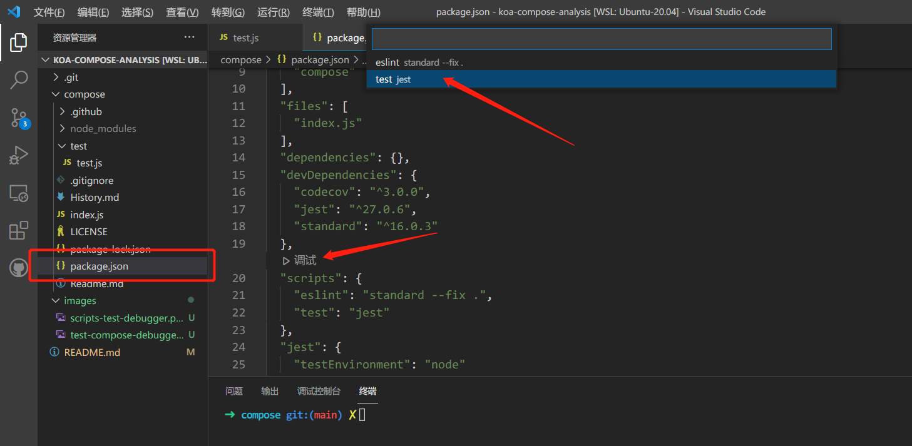
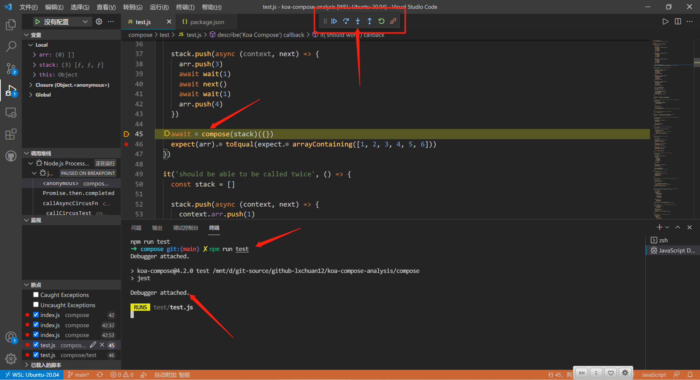

# koa-compose-analysis

## 1. 前言

大家好，我是[若川](https://lxchuan12.gitee.io)。欢迎关注我的[公众号若川视野](https://p1-jj.byteimg.com/tos-cn-i-t2oaga2asx/gold-user-assets/2019/12/13/16efe57ddc7c9eb3~tplv-t2oaga2asx-image.image "https://p1-jj.byteimg.com/tos-cn-i-t2oaga2asx/gold-user-assets/2019/12/13/16efe57ddc7c9eb3~tplv-t2oaga2asx-image.image")，最近组织了[**源码共读活动**《1个月，200+人，一起读了4周源码》](https://mp.weixin.qq.com/s?__biz=MzA5MjQwMzQyNw==&mid=2650756550&idx=1&sn=9acc5e30325963e455f53ec2f64c1fdd&chksm=8866564abf11df5c41307dba3eb84e8e14de900e1b3500aaebe802aff05b0ba2c24e4690516b&token=917686367&lang=zh_CN#rd)，感兴趣的可以加我微信 [ruochuan12](https://mp.weixin.qq.com/s?__biz=MzA5MjQwMzQyNw==&mid=2650756550&idx=1&sn=9acc5e30325963e455f53ec2f64c1fdd&chksm=8866564abf11df5c41307dba3eb84e8e14de900e1b3500aaebe802aff05b0ba2c24e4690516b&token=917686367&lang=zh_CN#rd) 参与，长期交流学习。

之前写的[《学习源码整体架构系列》](https://juejin.cn/column/6960551178908205093) 包含`jQuery`、`underscore`、`lodash`、`vuex`、`sentry`、`axios`、`redux`、`koa`、`vue-devtools`、`vuex4`十篇源码文章。

写相对很难的源码，耗费了自己的时间和精力，也没收获多少阅读点赞，其实是一件挺受打击的事情。从阅读量和读者受益方面来看，不能促进作者持续输出文章。

所以转变思路，写一些相对通俗易懂的文章。**其实源码也不是想象的那么难，至少有很多看得懂**。

本文涉及到的 [koa-compose 仓库](https://github.com/koajs/compose) 文件，整个`index.js`文件代码行数虽然不到 `50` 行，而且测试用例`test/test.js`文件 `300` 余行，但非常值得我们学习。

歌德曾说：读一本好书，就是在和高尚的人谈话。 同理可得：读源码，也算是和作者的一种学习交流的方式。

阅读本文，你将学到：

```bash
1. 熟悉 koa-compose 中间件源码、可以应对面试官相关问题
2. 学会使用测试用例调试源码
3. 学会 jest 部分用法
```

## 2. 环境准备

### 2.1 克隆 koa-compose 项目

```bash
# 可以直接克隆我的仓库，我的仓库保留的 compose 仓库的 git 记录
git clone https://github.com/lxchuan12/koa-compose-analysis.git
cd koa-compose/compose
npm i
```

顺带说下：我是怎么保留 `compose` 仓库的 `git` 记录的。

```bash
# 在 github 上新建一个仓库 `koa-compose-analysis` 克隆下来
git clone https://github.com/lxchuan12/koa-compose-analysis.git
cd koa-compose-analysis
git subtree add --prefix=compose https://github.com/koajs/compose.git main
# 这样就把 compose 文件夹克隆到自己的 git 仓库了。且保留的 git 记录
```

关于更多 `git subtree`，可以看这篇文章[用 Git Subtree 在多个 Git 项目间双向同步子项目，附简明使用手册](https://segmentfault.com/a/1190000003969060)

接着我们来看怎么根据开源项目中提供的测试用例调试源码。

### 2.2 根据测试用例调试 compose 源码

用`VSCode`（我的版本是 `1.60` ）打开项目，找到 `compose/package.json`，找到 `scripts` 和 `test` 命令。

```json
// compose/package.json
{
    "name": "koa-compose",
    // debug （调试）
    "scripts": {
        "eslint": "standard --fix .",
        "test": "jest"
    },
}
```

在`scripts`上方应该会有`debug`或者`调试`字样。点击`debug`(调试)，选择 `test`。



接着会执行测试用例`test/test.js`文件。
终端输出如下图所示。


```js
// compose/test/test.js
'use strict'

/* eslint-env jest */

const compose = require('..')
const assert = require('assert')

function wait (ms) {
  return new Promise((resolve) => setTimeout(resolve, ms || 1))
}

function isPromise (x) {
  return x && typeof x.then === 'function'
}
describe('Koa Compose', function () {
    // 省略
})
```

接着我们调试 `compose/test/test.js` 文件。
我们可以在 `45行` 打上断点，重新点击 `package.json` => `srcipts` => `test` 进入调试模式。
如下图所示。



接着按上方的按钮，继续调试。在`compose/index.js`文件中关键词打上断点，学习源码。

## 3. 跟着测试用例学源码

## 4. 总结
