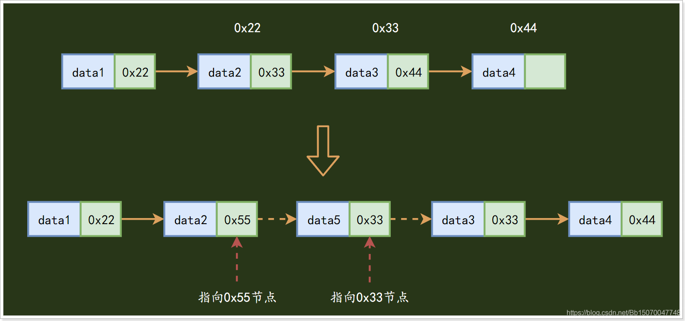

# 数据结构：八种数据结构大全

数据结构
1.1 数据结构概述
数据结构是计算机存储、组织数据的方式；通常情况下，精心选择的数据结构可以带来更高的运行或者存储效率。数据结构的优良将直接影响着我们程序的性能；常用的数据结构有：数组（Array）、栈（Stack）、队列（Queue）、链表（Linked List）、树（Tree）、图（Graph）、堆（Heap）、散列表（Hash）等；

1.2 数据结构的分类
1.2.1 排列方式
1）集合
集合：数据结构中的元素之间除了“同属一个集合” 的相互关系外，别无其他关系；

2）线性结构
线性结构：数据结构中的元素存在一对一的相互关系；

3）树形结构
树形结构：数据结构中的元素存在一对多的相互关系；

4）图形结构
图形结构：数据结构中的元素存在多对多的相互关系；

1.2.2 逻辑结构
数据结构按逻辑上划分为线性结构与非线性结构；

线性结构：有且仅有一个开始结点和一个终端结点，并且所有结点都最多只有一个直接前驱和一个直接后继。
典型的线性表有：链表、栈和队列。它们共同的特点就是数据之间的线性关系，除了头结点和尾结点之外，每个结点都有唯一的前驱和唯一的后继，也就是所谓的一对一的关系。

非线性结构：对应于线性结构，非线性结构也就是每个结点可以有不止一个直接前驱和直接后继。常见的非线性结构包括：树、图等。

1.3 数据结构的实现
1.2.1 数组
数组（Array）：数组是有序元素的序列，在内存中的分配是连续的，数组会为存储的元素都分配一个下标（索引），此下标是一个自增连续的，访问数组中的元素通过下标进行访问；数组下标从0开始访问；

数组的优点是：查询速度快；

数组的缺点是：删除增加、删除慢；由于数组为每个元素都分配了索引且索引是自增连续的，因此一但删除或者新增了某个元素时需要调整后面的所有元素的索引；
新增一个元素40到3索引下标位置：

删除2索引元素：

总结：数组查询快，增删慢，适用于频繁查询，增删较少的情况；

1.2.2 链表
链表（Linked List）：链表是由一系列节点Node（也可称元素）组成，数据元素的逻辑顺序是通过链表的指针地址实现，通常情况下，每个节点包含两个部分，一个用于存储元素的内存地址，名叫数据域，另一个则指向下一个相邻节点地址的指针，名叫指针域；根据链表的指向不同可分为单向链表、双向链表、循环链表等；我们本章介绍的是单向链表，也是所有链表中最常见、最简单的链表；
链表的节点（Node）：

完整的链表：

链表的优点：新增节点、删除节点快；
在链表中新增一个元素：

在单向链表中，新增一个元素最多只会影响上一个节点，比在数组中的新增效率要高的多；

在链表中删除一个元素：

链表的缺点：
1）查询速度慢，查询从头部开始一直查询到尾部，如果元素刚好是在最尾部那么查询效率势必非常低；
2）链表像对于数组多了一个指针域的开销，内存相对占用会比较大；
总结：数据量较小，需要频繁增加，删除操作的场景，查询操作相对较少；

1.2.3 栈
栈（Stack）：是一种特殊的线性表，仅能在线性表的一端操作，栈顶允许操作，栈底不允许操作。 栈的特点是：先进后出从栈顶放入元素的操作叫入栈（压栈），取出元素叫出栈（弹栈）。
入栈操作：

出栈操作：

栈的特点：先进后出，Java中的栈内存就是一个栈的数据结构，先调用的方法要等到后调用的方法结束才会弹栈（出栈）；

1.2.4 队列
队列（Queue）：队列与栈一样，也是一种线性表，其限制是仅允许在表的一端进行插入，而在表的另一端进行删除。队列的特点是先进先出，从一端放入元素的操作称为入队，取出元素为出队；

队列的特点：先进先出；

1.2.5 树
树是一种数据结构，它是由n（n>=1）个有限节点组成一个具有层次关系的集合。把它叫做 “树” 是因为它看起来像一棵倒挂的树，也就是说它是根朝上，而叶朝下的。它具有以下的特点：

1）每个节点有0个或多个子节点；
2）没有父节点的节点称为根节点；
3）每一个非根节点有且只有一个父节点；
4）除了根节点外，每个子节点可以分为多个不相交的子树；
5）右子树永远比左子树大，读取顺序从左到右；
树的分类有非常多种，平衡二叉树（AVL）、红黑树RBL（R-B Tree）、B树（B-Tree）、B+树（B+Tree）等，但最早都是由二叉树演变过去的；

二叉树的特点：每个结点最多有两颗子树

1.2.6 堆
堆（Heap）：堆可以看做是一颗用数组实现的二叉树，所以它没有使用父指针或者子指针。堆根据“堆属性”来排序，“堆属性”决定了树中节点的位置。

堆的特性：如果一个结点的位置为k，则它的父结点的位置为[k/2]，而它的两个子结点的位置则分别为2k和2k+1。这样，在不使用指针的情况下，我们也可以通过计算数组的索引在树中上下移动：从arr[k]向上一层，就令k等于k/2,向下一层就令k等于2k或2k+1。

堆的定义如下：n个元素的序列{k1,k2,ki,…,kn}当且仅当满足下关系时，称之为堆；

(ki <= k2i,ki <= k2i+1)或者(ki >= k2i,ki >= k2i+1)满足前者的表达式的成为小顶堆（小根堆），满足后者表达式的为大顶堆（大根堆），很明显我们上面画的堆数据结构是一个大根堆；

大小根堆数据结构图：

一般来说将根节点最大的堆叫做最大堆或大根堆，根节点最小的堆叫做最小堆或小根堆。常见的堆有二叉堆、斐波那契堆等。

1.2.7 散列表
散列表（Hash），也叫哈希表，是根据键和值 (key和value) 直接进行访问的数据结构，通过key和value来映射到集合中的一个位置，这样就可以很快找到集合中的对应元素。它利用数组支持按照下标访问的特性，所以散列表其实是数组的一种扩展，由数组演化而来。
散列表首先需要根据key来计算数据存储的位置，也就是数组索引的下标；

HashValue=hash(key)
散列表就是把Key通过一个固定的算法函数既所谓的哈希函数转换成一个整型数字，然后就将该数字对数组长度进行取余，取余结果就当作数组的下标，将value存储在以该数字为下标的数组空间里，这种存储空间可以充分利用数组的查找优势来查找元素，所以查找的速度很快。

在散列表中，左边是个数组，数组的每个成员包括一个指针，指向一个链表的头，当然这个链表可能为空，也可能元素很多。我们根据元素的一些特征把元素分配到不同的链表中去，也是根据这些特征，找到正确的链表，再从链表中找出这个元素。

1.2.8 图
图（Graph）：图是一系列顶点（元素）的集合，这些顶点通过一系列边连接起来组成图这种数据结构。顶点用圆圈表示，边就是这些圆圈之间的连线。顶点之间通过边连接。
图分为有向图和无向图：

有向图：边不仅连接两个顶点，并且具有方向；
无向图：边仅仅连接两个顶点，没有其他含义；

例如，我们可以把图这种数据结构看做是一张地图：

地图中的城市我们看做是顶点，高铁线路看做是边；很显然，我们的地图是一种无向图，以长沙到上海为例，经过的城市有长沙、南昌、杭州、上海等地；那么从上海也可以按照原有的路线进行返回；

实现了图这种数据结构之后我们可以在此数据结构上做一些复杂的算法计算，如广度优先搜索算法、深度优先搜索算法等；

广度搜索：搜索到一个顶点时，先将此顶点的所有子顶点全部搜索完毕，再进行下一个子顶点的子顶点搜索；

例如上图：以武汉为例进行广度搜索，

1）首先搜索合肥、南昌、长沙等城市；

2）通过合肥搜索到南京；

3）再通过南昌搜索到杭州、福州，

4）最终通过南京搜索到上海；完成图的遍历搜索；

不通过南京搜索到杭州是因为已经通过南昌搜索到杭州了，不需要再次搜索；

深度搜索：搜索到一个顶点时，先将此顶点某个子顶点搜索到底部（子顶点的子顶点的子顶点…），然后回到上一级，继续搜索第二个子顶点一直搜索到底部；

例如上图：以武汉为例进行深度搜索，

1）首先搜索合肥、南京、上海等城市；

2）回到武汉，进行第二子顶点的搜索，搜索南昌、杭州等地；

3）回到南昌，搜索福州；

4）回到武汉，搜索长沙；

图是一种比较复杂的数据结构，在存储数据上有着比较复杂和高效的算法，分别有邻接矩阵 、邻接表、十字链表、邻接多重表、边集数组等存储结构。我们本次了解到这里即可；
————————————————
版权声明：本文为CSDN博主「緑水長流*z」的原创文章，遵循CC 4.0 BY-SA版权协议，转载请附上原文出处链接及本声明。
原文链接：https://blog.csdn.net/Bb15070047748/article/details/119208588

