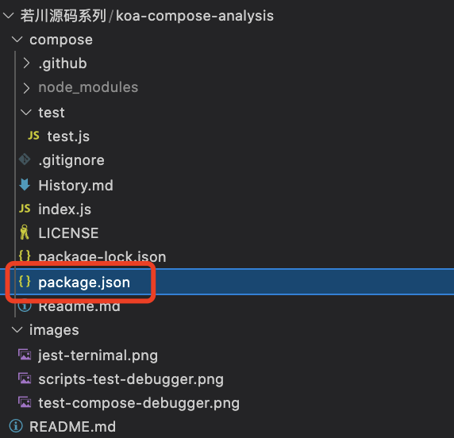
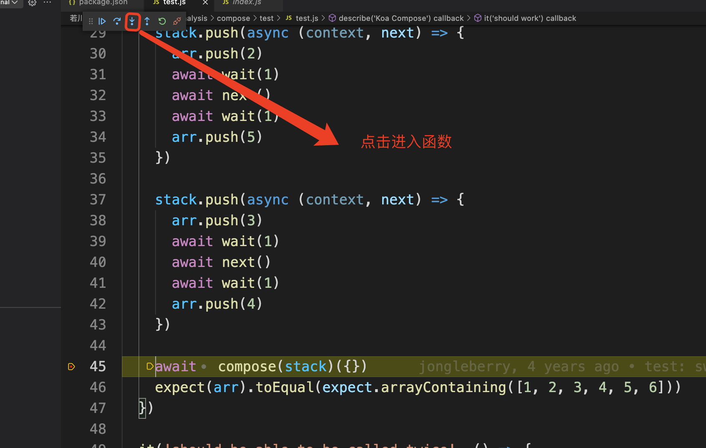

### 开启傻瓜式调试模式

1. 下载项目

 

```javascript
git clone https://github.com/lxchuan12/koa-compose-analysis.git
cd koa-compose/compose
npm i
```

1. 找到并打开test.js


1. 在test.js中第45行打一个断点

点击红框位置，你会发现有一个红点出现了，这样就打好断点了

为什么要在这里打断点，因为compose函数在这里调用了，我们想看看这个

函数里面究竟做了什么


1. 找到package.json




1. 你惊喜的发现，竟然跳到你打断点的哪里了

我是谁，我要干嘛，我干脆进去看看吧！（根据箭头指示进入函数）



1. compose干了什么

这时你发现进入到了函数内部，看到传进来的参数是什么后

你狂按下一步（箭头2标记的单步跳过，快捷键F10）


1. 遇到循环了，太TM烦了，一直点一直循环，我该怎么办？


1. 咦，咋又回去了，我是谁我要干嘛？


1. 这下对劲了，我懂了，我会了，我知道要干嘛了


10.dispatch解读


### 川哥举办的源码调试给我带来了什么？

1. 开始尝试写笔记

1. 1. 源码我都懂，让我说出来或者写出来，蒙了

1. 更注重细节

1. 1. 以前看源码就囫囵吞枣的过一遍

1. 更注重应用场景

1. 1. 以前：原来这个方法是这样实现的啊
   2. 现在：看下测试用例，都是怎么使用的，某个判断是为了解决什么问题

### 总价

是一个老手，那么现在川哥给了你一个交流的平台，去温故而知新。

是一个新手，千里之行始于足下，有群里川哥和大佬们的帮助，勇敢迈出第一步。

写笔记真是一个令人头疼的东西。。。。。